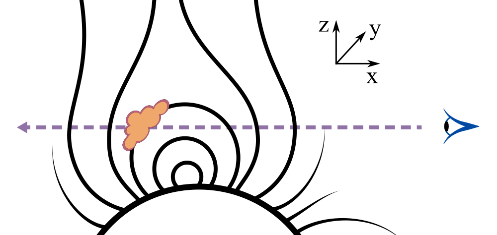
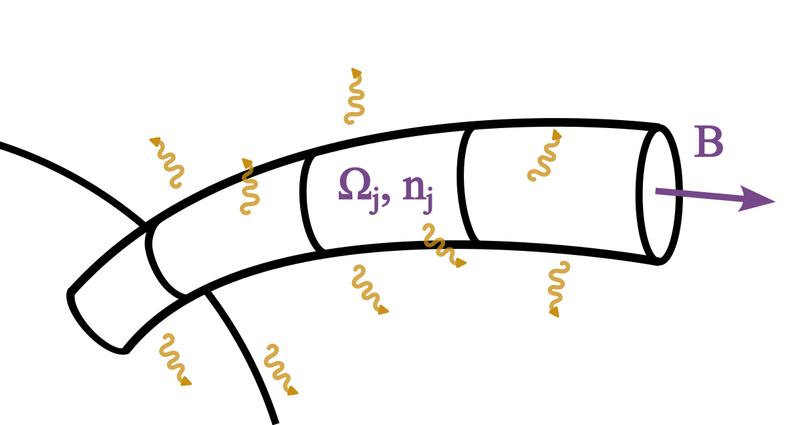
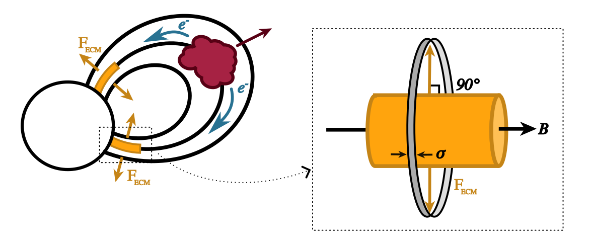

Magnetic Field Line Processing
------------------------------   

The synthetic observation generation code of ``CoronaLab`` was built on a Potential Field Source 
Surface (PFSS) model implemented in the programming language ``IDL``, originally by van 
Ballegooijen et al (1998) [1]_, and updated through the years by Prof. Moira Jardine and her students 
and postdocs [2]_. The ``IDL`` package included the magnetic field extrapolation, magnetic field 
line tracing, calculation of pressure and density along the field lines, and prominence detection.    

While the PFSS extrapolation and magnetic field line tracing uses a standard algorithm that has been 
implemented robustly in ``Python`` (i.e. in the the 
`sunkit-magex <https://docs.sunpy.org/projects/sunkit-magex/en/latest/>`_ package), the prominence 
finding and characterisation does not. That part of the original model is therefore included in this 
package within the `~corona_lab.build_corona.FieldlineProcessor` class.

The `~corona_lab.build_corona.FieldlineProcessor.build_model_corona` function processes open and 
closed magnetic field lines, each given as a `~astropy.table.Table` object with columns for the 
field line cell position in spherical coordinates (:math:`r,~\theta,~\phi`), and magnetic field 
components (:math:`B_r,~B_\theta, B_\phi`), and returns a `~corona_lab.corona.ModelCorona` object. 
The additional stellar characteristics required to build a `~corona_lab.corona.ModelCorona` are: 
radius (:math:`R_\star`), mass (:math:`M_\star`), rotation period (:math:`P_\star`), and optionally 
distance (:math:`d`). 

The model parameters required to build a `~corona_lab.corona.ModelCorona` are: closed corona and 
prominence temperatures (:math:`T`, :math:`T_{prom}`), the scaling factor (:math:`\kappa_p`) that 
relates pressure to magnetic field strength (see Eq. :eq:`eq5-kappa`), source surface radius 
(:math:`R_{ss}`), and grid resolution in θ and φ (:math:`\mathrm{d}\theta`, :math:`\mathrm{d}\phi`). 
All parameters (other than :math:`-\log\kappa_p`, which is unitless) must be supplied as 
`~astropy.units.Quantity` objects with appropriate units [3]_ .

The following table summarizes all of these requirements:

.. list-table:: 
   :widths: 20 10 60
   :header-rows: 1
    
   * - **Property**
     - **Symbol**
     - **Meaning**
    
   * - **Field Line Columns**
     -
     -
   * - radius, theta, phi 
     - :math:`r, \theta, \phi`
     - Position in spherical coordinates (rotation axis is at θ = 90°)
   * - ds
     - :math:`\mathrm{d}s`
     - Segment length for each field line cell
   * - Brad, Btheta, Bphi 
     - :math:`B_r, B_\theta, B_\phi`
     - Magnetic field components
   * - Bmag
     - :math:`B`
     - Magnetic field strength ( √(B\ :sub:`r`\ ² + B\ :sub:`θ`\ ² + B\ :sub:`φ`\ ²) )

   * - **Stellar Characteristics**
     -
     -
   * - Mass
     - :math:`M_\star`
     - Stellar mass
   * - Radius
     - :math:`R_\star`
     - Stellar radius
   * - Period
     - :math:`P_\star`
     - Rotation period
   * - Distance
     - :math:`d`
     - Distance (optional)
   * - mean_ptc_mass 
     - :math:`m`
     - Mean particle mass in the stellar corona (optional, defaults to pure hydrogen)
    
    
   * - **Model Parameters** 
     - 
     - 
   * - T_cor
     - :math:`T`
     - Isothermal corona temperatrue (excepting prominences)
   * - T_prom
     - :math:`T_{prom}`
     - Prominence temperature (optional, default is 85000 K [4]_ )
   * - kappa_power
     - :math:`-\log\kappa_p`
     - Pressure scaling factor power (defines base pressure as :math:`p_0 = \kappa_p B_0^2`)
   * - rss
     - :math:`R_{ss}`
     - Source surface (considered the outer radius of the model)
   * - dtheta, dphi
     - :math:`\mathrm{d}\theta`, :math:`\mathrm{d}\phi`
     - Grid resolution in θ and φ (Determines cross-sectional area of field line flux tube)
 

Each field line is processed individually. If it is an open field line, the processing is minimal: 
the cross-sectional area and segment volume are calculated out to the corona edge (:math:`R_{ss}`), 
and the pressure is set to zero along the whole line.The cross-sectional area is calculated by 
allowing the field line to fill the a full grid cell at the source surface, and then scaling by 
the magnetic field strength along the line:

.. math::

    dA_c(s) = (\mathrm{d}\theta \times \mathrm{d}\phi \times R_{ss})\frac{B(s_{max})}{B(s)}

where :math:`s` is the position along the field line, and :math:`s_max` is the field line position 
where :math:`r = R_{ss}`. 

The segment volume can than be calculated easily with 
:math:`\mathrm{d}V = \mathrm{d}A_c \times \mathrm{d}s`. This minimal processing is because the 
authors have so far not needed to include the wind in flux calculations, however, the wind 
processing is in its own function and can be overwritten with a more robust treatment if desired 
(if you do that please consider submitting a pull request with your solution so it can be added 
to this package).

For closed field lines, the cross-sectional area and segment volumes are first calculated as for 
the open field lines, but then, assuming an isothermal corona at temperature :math:`T` in 
hydrostatic equilibrium, the pressure is calculated along the field line as:

.. math::

   p = p_0 \exp\left(\frac{m}{k_B T} \int g_s \, ds\right)

where :math:`g_s` is the component of effective gravity along the field line 
(:math:`g_s = (\mathbf{g} \cdot \mathbf{B}) / |\mathbf{B}|`), :math:`p_0` is the pressure at the 
field line footpoint, :math:`m` is the mean particle mass, :math:`k_B` is the Boltzmann constant, 
and :math:`\mathrm{d}s` is the incremental length along the field line.

The plasma pressure at the footpoint is defined by:

.. math::
   :label: eq5-kappa

   p_0(\theta, \phi) = \kappa_p B_0^2 (\theta, \phi)

where :math:`\kappa_p` is a dimensionless quantity input to the model, :math:`B_0` is in Gauss, 
and :math:`p_0` is in Pascals. This formulation is presented and justified in 
Jardine et al. (2002) [5]_.

With the pressure calculated, we follow the method given by Jardine et al. (2020) [6]_ to search 
along the field line for stable points where prominences can form. We search for pressure 
maxima—points that satisfy:

.. math::

   (\mathbf{B} \cdot \nabla)(\mathbf{g} \cdot \mathbf{B}) = 0

where :math:`\mathbf{B}` is the magnetic field and :math:`\mathbf{g}` is the effective gravity 
(see Ferreira (2000) [7]_ for a detailed discussion of the stability and criterion, and 
Appendix F from Brasseur (2025) [8]_ for a visualisation of this principle).

At a stable point, prominence density is calculated with:

.. math::

   \rho_{sp} = \frac{B^2}{\mu g_\perp R_c}

where :math:`B` is the magnetic field strength, :math:`g_\perp` is the component of gravity 
perpendicular to the field, and :math:`R_c` is the radius of curvature (all at the stable point), 
and :math:`\mu` is the magnetic permeability.

We then verify whether the stable point can support a prominence by comparing this density to the 
coronal density at that location. If support is possible, the field line flux tube is filled with 
mass, allowing the prominence to spread hydrostatically to four pressure scale heights, assigning 
each cell a density:

.. math::

   \rho_i = \rho_{sp} \frac{p_i}{p_{sp}}

where :math:`p_i` is the local pressure and :math:`p_{sp}` is the pressure at the stable point. 

Cells meeting this criterion are flagged as part of the prominence, and density and pressure are 
updated accordingly.

Once all field lines have been processed, and prominence masses and locations identified, the 
final collection is converted into a `~corona_lab.corona.ModelCorona` object, ready for synthetic 
data product generation or further analysis.

**Sources**

    
.. [1] `van Ballegooijen, A. A., Cartledge, N. P., & Priest, E. R. 1998, ApJ, 501, 866 <https://ui.adsabs.harvard.edu/abs/1998ApJ...501..866V>`_

.. [2] `Cartledge, N. P. 1996, PhD thesis, Saint Andrews University, UK <https://research-repository.st-andrews.ac.uk/handle/10023/32228>`_; 
       `van Ballegooijen, A. A., Cartledge, N. P., & Priest, E. R. 1998, ApJ, 501, 866 <https://ui.adsabs.harvard.edu/abs/1998ApJ...501..866V>`_; 
       `Mackay, D. H., Longbottom, A. W., & Priest, E. R. 1999, Sol. Phys., 185, 87 <https://ui.adsabs.harvard.edu/abs/1999SoPh..185...87M/abstract>`_; 
       `Hussain, G. A. J., van Ballegooijen, A. A., Jardine, M., & Collier Cameron, A. 2002, ApJ, 575, 1078 <https://ui.adsabs.harvard.edu/abs/2002ApJ...575.1078H/abstract>`_; 
       `Johnstone, C., Jardine, M., & Mackay, D. H. 2010, MNRAS, 404, 101 <https://ui.adsabs.harvard.edu/abs/2010MNRAS.404..101J/abstract>`_; 
       `Faller, S. J., & Jardine, M. M. 2022, MNRAS, 513, 5611 <https://ui.adsabs.harvard.edu/abs/2022MNRAS.513.5611F/abstract`_; 

.. [3] `Astropy Collaboration, Price-Whelan, A. M., Lim, P. L., et al. 2022, ApJ, 935, 167 <https://ui.adsabs.harvard.edu/abs/2022ApJ...935..167A>`_

.. [4] `Collier Cameron, A., & Robinson, R. D. 1989a, MNRAS, 236, 57 <https://ui.adsabs.harvard.edu/abs/1989MNRAS.236...57C/abstract>`_

.. [5] `Jardine, M., Collier Cameron, A., & Donati, J. F. 2002, MNRAS, 333, 339 <https://ui.adsabs.harvard.edu/abs/2002MNRAS.333..339J/>`_

.. [6] `Jardine, M., Collier Cameron, A., Donati, J. F., & Hussain, G. A. J. 2020, MNRAS, 491, 4076 <https://ui.adsabs.harvard.edu/abs/2020MNRAS.491.4076J/abstract>`_

.. [7] `Ferreira, J. M. 2000, MNRAS, 316, 647 <https://ui.adsabs.harvard.edu/abs/2000MNRAS.316..647F/abstract>`_

.. [8] `Brasseur, C. E. 2025, PhD thesis, University of St Andews, St Andrews, UK <https://research-repository.st-andrews.ac.uk/handle/10023/32228>`_

Free-free Radio Image Creation
------------------------------

Currently, the synthetic free-free images are produced only from the closed magnetic field lines. 
This is not due to anything inherent in the code, but rather is a result of the minimal open field 
line processing discussed in the previous section, thus if a model is supplied with temperature 
and density information provided along the open field lines as well, the contributions of the wind 
will be included in the free-free calculations. 

The basic method for producing a synthetic free-free image is to choose a viewing angle and then 
calculate the flux along a number of sight lines that correspond to the desired resolution of the 
image. 

The following diagram illustrates an example sight-line through the stellar corona, crossing both 
open and closed field lines, as well as passing through a prominence:

The method for calculating the free-free flux is based on that of Wright and Barlow (1975) [9]_, 
who presented a model for the radio and infrared spectrum of early-type stars, based on the 
assumption of uniform mass loss. The original formulation of this model required the stellar wind 
to be assumed spherically symmetrical and at terminal velocity. Daley Yates et al (2016) [10]_ 
used numerical methods to relax these constraints and used the resulting algorithm to create 
synthetic radio emission observations for accelerating stellar winds. We follow their method, 
but further relax the constant temperature constraint to account for the presence of stellar 
prominences.

In this calculation we assume the entire corona consists of fully ionised hydrogen, emitting 
Blackbody continuum radiation at the given temperature in each cell. The assumption of full 
ionisation is very close to the true conditions throughout the corona, which is hot enough to 
be fully ionised and is nearly entirely made up of hydrogen. For the prominences, however, while 
they have the same atomic makeup as the corona, because they are cooler and denser, a smaller 
proportion of the plasma will be ionised. The neutral plasma in the prominences does not, however, 
affect the ability of the magnetic field to confine the prominence plasma. This was determined in 
studies of the Sun such as Pneuman and Kopp (1971) [11]_.

Given our assumptions, the intensity of the emission at every point in the corona can be expressed 
by Planck's law (which we use in its full form rather than the Rayleigh–Jeans approximation). 
Planck's law describes the radiation emitted at each location. However, we must also consider 
the opacity of the coronal plasma and prominences, meaning the intensity that reaches the observer 
will be:

.. math::

   I_\nu(y,z) = \int_{-\infty}^{\infty}B_\nu \left ( T(x,y,z) \right )~e^{-\tau(x,y,z)}\kappa_{ff}(x,y,z)~\mathrm{d}x

where :math:`I_\nu(y,z)` is the intensity at position :math:`(y,z)` in the observation plane, 
:math:`B_\nu` is the Blackbody emission source function at position :math:`(x,y,z)` in the 
corona for a observing frequency :math:`\nu`,  :math:`\tau` is the optical depth at position 
:math:`(y,z)`  and distance :math:`x` along the line of sight, and :math:`\kappa_{ff}` is the 
free-free absorption coefficient [12]_. The integral is defined over the entire line of sight; 
in practice, this means we integrate across the volume of our model.

As we are only modelling free-free emission, the optical depth is related to the absorption 
coefficient by:

.. math::

   \mathrm{d}\tau = \kappa_{ff}~\mathrm{d}x

where :math:`\mathrm{d}\tau` is the infitesimal optical depth of the material accross 
:math:`\mathrm{d}x`.

Mihalas (1978) [13]_ derives the free-free absorption coefficient using the quantum defect method, 
assuming local thermodynamic equilibrium and a fully ionised hydrogen atmosphere. In CGS units:

.. math::

   \kappa_{ff} = 0.0178 \frac{Z^2 g_{ff}}{T^{3/2} \nu^2} n_e n_i

where :math:`Z` is the ion charge, :math:`g_{ff}` is the Gaunt factor, :math:`T` is the 
temperature (K), :math:`\nu` is the observing frequency (Hz), :math:`n_e`, :math:`n_i` 
are electron and ion number densities (cm\ :sup:`-3`).

We use the free-free Gaunt factor derived by van Hoof et al. (2014) [14]_:

.. math::

   g_{ff} = 9.77 + 1.27\log_{10} \left( \frac{T^{3/2}}{\nu Z} \right )

where all of the symbols are the same as in the previous equation.

Combining the above three equations, for a given viewing angle, we calculate the optical depth 
along a particular sight-line (in the :math:`\hat{\mathbf{x}}` direction) based on the 
free-free absorption coefficient (:math:`\kappa_{ff}`) and the opacity of the material 
between the viewer and the x-axis position. Thus

.. math::

   I_\nu = \sum^j B_\nu(T_j) e^{-\tau_j} \kappa_{ff,j} \mathrm{d}x_j

and,

.. math::

   \tau_j = \sum_{i=0}^{j} \kappa_{ff,i} \mathrm{d}x_i

where :math:`I_\nu(y,z)` is the intensity at frequency :math:`\nu` for the sight-line defined by 
the Cartesian position :math:`(y,z)`, :math:`B_\nu(T_j)` is the Blackbody source function at 
frequency :math:`\nu` for the temperature :math:`T` at position :math:`x_j`, and 
:math:`\tau_j` is the optical depth at position :math:`x_j`.

The model is constructed with the rotation axis aligned with the :math:`\hat{z}` direction and 
rotational phase :math:`\phi = 0^\circ`. We can rotate the model arbitrarily to simulate any 
viewing angle and phase.

We rotate our model to the desired viewing angle, and then interpolate onto a Cartesian grid at 
the specified resolution. The interpolation is done using the nearest neighbour method. 
Once we have a 3D Cartesian grid aligned with the line-of-sight, we can numerically integrate 
through the cube to get first the optical depth in each grid cell, and then the intensity. 
The last step necessary for comparing our synthetic images with real data is to translate the 
calculated intensity into observed flux. 

The spectral flux density (:math:`S_\nu`) at distance :math:`d` is given by:

.. math::

   S_\nu = \int_{-\infty}^{\infty} \int_{-\infty}^{\infty} \frac{\pi I_\nu(y,z)}{d^2} \,\mathrm{d}y\,\mathrm{d}z

For each individual pixel, this becomes:

.. math::

   S_\nu(y,z) = \frac{\pi I_\nu(y,z)}{d^2} \,\mathrm{d}y\,\mathrm{d}z

where :math:`\mathrm{d}y` and :math:`\mathrm{d}z` are the dimensions of the pixel, and the total 
spectral flux density is:

.. math::

   S_\nu = \sum_j \sum_i \frac{\pi I_\nu(y_j,z_i)}{d^2} \,\mathrm{d}y_j\,\mathrm{d}z_i

**Sources**

.. [9] `Wright, A. E., & Barlow, M. J. 1975, MNRAS, 170, 41 <https://ui.adsabs.harvard.edu/abs/1975MNRAS.170...41W/abstract>`_

.. [10] `Daley-Yates, S., Stevens, I. R., & Crossland, T. D. 2016, MNRAS, 463, 2735 <https://ui.adsabs.harvard.edu/abs/2016MNRAS.463.2735D/abstract>`_

.. [11] `Pneuman, G. W., & Kopp, R. A. 1971, Sol. Phys., 18, 258 <https://ui.adsabs.harvard.edu/abs/1971SoPh...18..258P/abstract>`_

.. [12] `Daley-Yates, S., Stevens, I. R., & Crossland, T. D. 2016, MNRAS, 463, 2735 <https://ui.adsabs.harvard.edu/abs/2016MNRAS.463.2735D/abstract>`_

.. [13] Mihalas, D. 1978, Stellar atmospheres (San Francisco, CA: W. H. Freeman and Company)

.. [14] `van Hoof, P. A. M., Williams, R. J. R., Volk, K., et al. 2014, MNRAS, 444, 420 <https://ui.adsabs.harvard.edu/abs/2014MNRAS.444..420V/abstract>`_

ECM Dynamic Spectrum Creation
-----------------------------

Here we are specifically calculating Electron Cyclotron Maser (ECM) emission resulting from
the ejection of stellar prominences, thus the emitted energy is tied to specifically chosen
prominence bearing fieldlines. 

The basic method for producing a synthetic dynamic spectrum is to calculate, for each magnetic 
field line with an ejected prominence, all the cells in which Electron Cyclotron Maser (ECM) 
emission occurs, and record the flux and frequency of the emission. Then the star is rotated, 
and the visible emission at each observing frequency is calculated for each viewing angle.

The condition for ECM emission to be possible is that the electron plasma frequency,

.. math::

    \omega_p=\frac{e}{2 \pi} \sqrt{\frac{n_e}{m_e \epsilon_0}} \approx 9 \sqrt{n_e} \mathrm{~kHz}

must be less than the electron-gyrofrequency, (the angular frequency associated with the circular 
motion exhibited by charged particles in the presence of a uniform magnetic field):

.. math::

    \Omega=\frac{e B}{2 \pi m_e} \approx 28 B \mathrm{~kHz},

where :math:`e` is the elementary charge, :math:`n_e` is the electron number density 
(m :math:`^{-3}`), :math:`m_e` is the electron mass, :math:`\epsilon_0` is the permittivity of 
free space, and :math:`B` is the magnetic field strength (G) [15]_ .

The energy powering the ECM emission results from the ejection event increasing the potential 
energy of the prominence rising towards zero as it is ejected, allowing the accelerated electrons 
to tap into the associated gravitational potential energy reservoir. Thus, the total energy 
available (:math:`E_{tot}`) is the original gravitational potential of the prominence. 
However, of course this is not a perfectly efficient process, so we must multiply the gravitational 
potential by an efficiency factor :math:`\epsilon`. The energy is being emitted in the form of 
photons, meaning that we describe the emitted energy as a sum of the energies of the emitted 
photons. Putting this together, we can describe emission with the following equations:

.. math::

    \begin{aligned}
        E_{tot} &= \epsilon\frac{G M_\star m_{prom}}{r_{prom}}\\
                &= \sum_i h \nu_i
    \end{aligned}

where :math:`M_\star` and :math:`m_{prom}` are the stellar and ejected prominence masses 
respectively, :math:`r_{prom}` is the distance between the centre of the star and the ejected 
prominence, :math:`h` is Planck's constant, and :math:`\nu_i` is the frequency of an 
individual photon. 

This equation shows the equivalence between the kinetic energy released by the ejection of 
the prominence and the energy of the resulting photon emission. The efficiency factor, 
:math:`\epsilon`, accounts for the various ways in which this energy conversion is less than 
100% efficient. Because the contributing processes are not well constrained, we encapsulate 
them all in a single efficiency factor. One direction for future work would be to better 
constrain the efficiencies of the individual processes, which would help place tighter 
limits on :math:`\epsilon`. Sources of energy loss include the inherent inefficiencies in 
converting kinetic energy to magnetic reconnection energy, and subsequently to ECM energy. 
Additionally, there are observational limitations, which we do not model separately, as the 
uncertainty in the physical efficiency is much greater than any instrumental effects.

In our model, the flux tube is divided into segments where each segment has a single value of 
magnetic field strength (and therefore gyrofrequency :math:`\Omega`) and number density (:math:`n`) 
as illustrated in the following diagram. 

We can thus calculate the emitted energy for each segment individually and take the sum for the 
total energy. We write the segment energy as:

.. math::

    E_{j} = n_j h \Omega_j

where :math:`n_j` is the number of photons in the segment, and :math:`\Omega_j` is the local 
gyrofrequency. The total energy is simply the sum of the energies from each individual segment:

.. math::

    E_{tot}=\sum_{j} E_{j} = \sum_{j} n_{j} h \Omega_{j}

We can therefore write the energy from each segment as a fraction of the total energy available:

.. math::

    E_{j} = \frac{h n_{j} \Omega_{j}}{\sum\limits_{j} h n_{j} \Omega_{j}} E_{tot} = \frac{n_{j} \Omega_{j}}{\sum\limits_{j} n_{j} \Omega_{j}} E_{tot}.

Because conservation of momentum requires that the number of electrons passing through a 
given section of the flux tube is constant, the number density must be proportional to the 
segment length (:math:`n_i \propto \mathrm{d} s_i`), so we can write the segment energy as:

.. math::

    E_{j} = E_{tot} \frac{\mathrm{d} s_{j} \Omega_{j}}{\sum\limits_{j} \mathrm{d} s_{j} \Omega_{j}} 

This is now in a form that can be modelled. However, as discussed at the start of this section, 
not every segment will actually be able to emit, so while the energy from the ejected prominence is 
spread along the flux tube, ECM emission will only be produced where conditions allow it to escape.

The energy is not emitted instantaneously of course, and we model it as emitted over some 
timescale :math:`\tau`, meaning we can write the power from an emitting segment as:

.. math::

    P_{j}=\frac{E_j}{\tau}

and, given an observed frequency range :math:`\Delta\nu`, the luminosity as:

.. math::

    L_j=\frac{(E_j/\tau)}{\Delta\nu}.

To calculate the observed ECM flux, we need to know the surface area into which the segment is 
emitting. ECM emission is directional with photons being emitted into a hollow cone distribution 
with thickness :math:`\sigma` and an opening angle of :math:`90^\circ` relative to the magnetic 
field vector (:math:`\mathbf{B}`), as illustrated here:

Experiments have shown that :math:`\sigma` is about :math:`1-2^\circ`, and we have set the default 
value in this software to :math:`\sigma=1^\circ` [16]_. Thus, the magnetic field segment emits into 
a cylinder with a radius of the distance to the observer, and height defined by the 
thickness angle :math:`\sigma`. This means that the surface area of the cylinder into which the 
segment is emitting is :math:`2\pi \sigma d^2`, where :math:`d` is the distance from the segment 
where the measurement is taken. So, given that flux is luminosity per unit area, we can write the 
flux observed at distance :math:`d` as:

.. math::

    F_\nu=\frac{L_\nu}{2\pi \sigma d^2 }

where :math:`L_\nu` is the luminosity at frequency :math:`\nu`, :math:`\sigma` is the hollow cone 
thickness, :math:`d` is distance, and we have used the small angle approximation to calculate the 
cylinder height as :math:`\sigma d`.

Because the emission is directional and not isotropic, we must also consider the angle between the 
observer and the emission and determine how much, if any, of the emission is visible at a given 
viewing angle. We can write the fraction of the emitted emission that reaches the observer from a 
particular segment of the flux tube as:

.. math::

    f_{j,obs} = e^{-\theta_j^2/(2\sigma^2)}

where :math:`\theta_j` is the angle between the segment's magnetic field :math:`\mathbf{B_j}` 
and the plane of the sky, and :math:`\sigma` is the thickness of the emission cone. 
When the observer is looking down the flux tube segment (parallel to :math:`\mathbf{B_j}`, 
:math:`\theta=\pi/2`), they will see no ECM emission, while when they are positioned side-on 
(orthogonal to :math:`\mathbf{B_j}`, :math:`\theta=0`) they will see the maximum emission.

Putting this all together, we calculate the observed ECM flux from a magnetic field segment 
(if conditions allow emission) as:

.. math::

    F_{j}=e^{\frac{-\Delta \theta_j^2}{2 \delta^2}} \frac{E_{tot}/(\tau\Delta \nu )}{2 \pi \sigma  D^2 } \frac{d s_j \Omega_j}{\sum\limits_{j} d s_j \Omega_j}

where all the symbols are as defined above.

**Sources**

.. [15] `Treumann, R. A. 2006, A&A Rev., 13, 229 <https://ui.adsabs.harvard.edu/abs/2006A%26ARv..13..229T/abstract>`_

.. [16] `Melrose, D. B., & Dulk, G. A. 1982, ApJ, 259, 844 <https://ui.adsabs.harvard.edu/abs/1982ApJ...259..844M/abstract>`_

