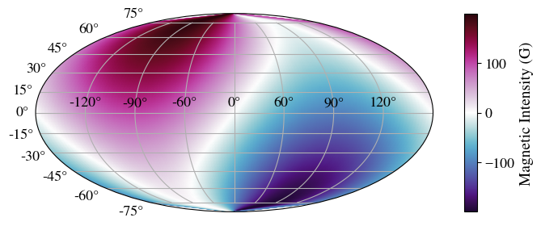
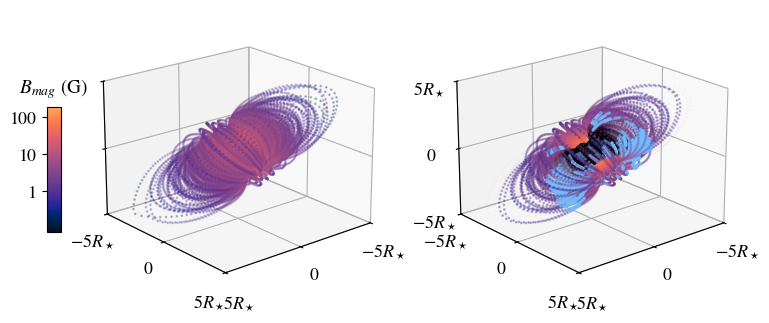
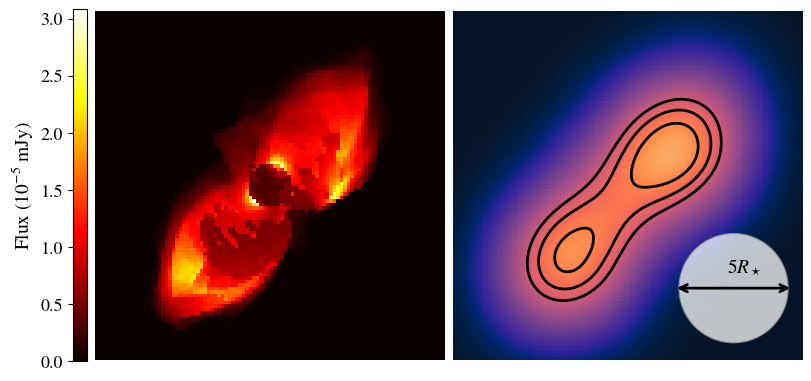
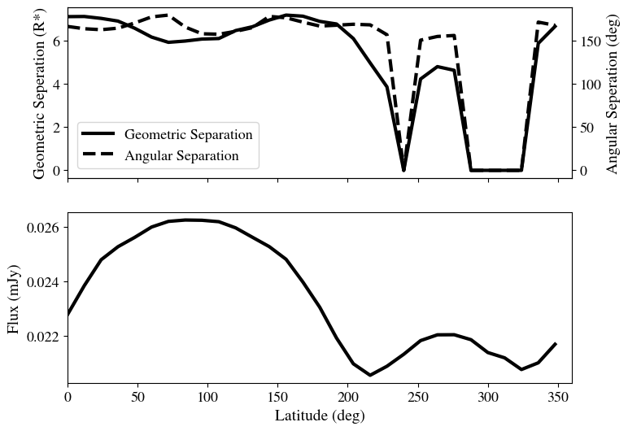
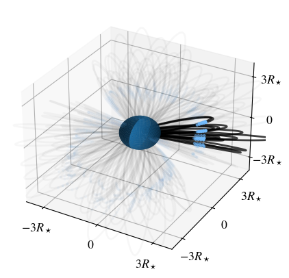
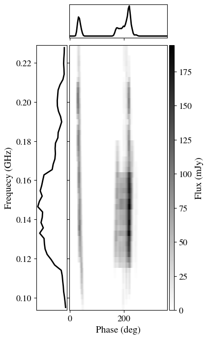
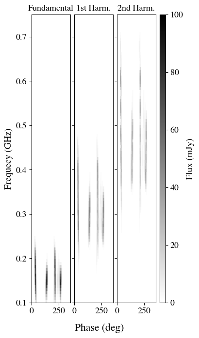
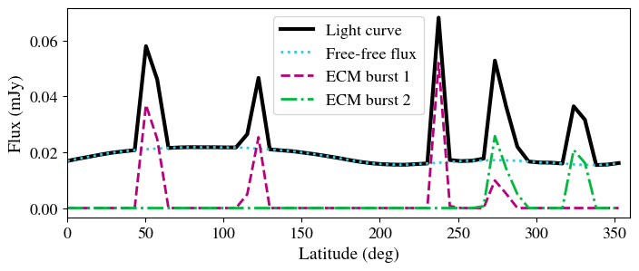

**Imports**

.. code:: ipython3

    import random
    
    import numpy as np
    import cmasher as cmr
    
    from time import time
    
    from astropy.table import QTable, Column
    from astropy.coordinates import SkyCoord
    from astropy.time import Time
    
    import astropy.constants as c
    import astropy.units as u
    
    from scipy import ndimage
    
    import sunpy.map
    from sunkit_magex import pfss
    
    import matplotlib.pyplot as plt
    from matplotlib.colors import LogNorm, PowerNorm
    from matplotlib.patches import Circle
    %matplotlib inline
    
    # For animation display
    import matplotlib.animation as animation
    from matplotlib import rc
    from IPython.display import HTML
    rc('animation', html='jshtml')
    
    CMAP = cmr.get_sub_cmap(cmr.torch, 0.1, .8)
    
    # All the CoronaLab imports
    from corona_lab.corona import ModelCorona, ModelDynamicSpectrum, PhaseCube
    from corona_lab.build_corona import FieldlineProcessor
    from corona_lab import analysis

A couple of useful functions we will use througout this  example.

.. code:: ipython3

    def find_nearest(arr, val):
        """
        Returns the index in arr where the value in arr is closest to val. 
        """
        
        diff_arr = np.abs(arr - val)
        return np.where(diff_arr == diff_arr.min())[0][0]

.. code:: ipython3

    def plot_sphere(ax):
        """
        Plot a unit sphere on axis ax. The axis is assumed to be 3D.
        """
    
        theta,phi = np.meshgrid(np.radians(np.arange(-180,180)),np.radians(np.arange(-90,90)))
    
        unit_x = np.cos(phi)*np.sin(theta)
        unit_y = np.sin(phi)*np.sin(theta)
        unit_z = np.cos(theta)
    
        ax.plot_surface(unit_x, unit_y, unit_z, alpha=1)

.. _build-corona:
Building the `~corona_lab.corona.ModelCorona`
---------------------------------------------

The ModelCorona package does not include functionality for extrapolating
the model magnetic field and tracing magnetic field lines, the the user
can use their prefered method for this. In this introduction we will use
the
`sunkit-magex <https://docs.sunpy.org/projects/sunkit-magex/en/latest/>`_
package to extrapolate the magnetic field between stellar surface and
source surface, and to trace the field lines. Here we just go through
this quickly, see the
`magex documentation <https://docs.sunpy.org/projects/sunkit-magex/en/latest/generated/gallery/index.html>`_
for proper instructions.

**Surface magnetic field map**

For this we will use a simple surface magnetic field that is nontheless
asymmetrical with respect to the rotation axis so that we can see the
effect of rotating the star on the eventual synthetic observations.

.. code:: ipython3

    # Construct input map coordinates in phi and s=cos(theta), and Br 
    phi = np.linspace(0, 2 * np.pi, 128)
    s = np.linspace(-1, 1, 64) # cos theta
    s, phi = np.meshgrid(s, phi)
    br = 100 * (s + np.sin(phi))

.. code:: ipython3

    fig = plt.figure()
    ax = fig.add_subplot(111, projection='mollweide')
    
    # Longitude is supposed to be -180-180, and pcolormeshdrid wants it to be in order
    im = ax.pcolormesh(phi-np.pi, np.arcsin(s) , br, cmap=cmr.viola, 
                        shading='gouraud')
    ax.set_xticks((np.linspace(-135, 135, 7)*u.deg).to(u.rad).value)
    ax.grid(True)
    
    cbar = fig.colorbar(im,ax=ax, aspect=15)
    cbar.set_label('Magnetic Intensity (G)')
    
    fig.tight_layout()

    fig.show()

**PFFS Extrapolation and fieldline tracing**

We set the source surface (edge of the model corona) to 8 stellar radii  (R*),
extrapolate the magnetic field, and trace field lines.

.. code:: ipython3

    nrho = 45
    rss = 8
    
    # Build the input map
    header = pfss.utils.carr_cea_wcs_header(Time('2020-1-1'), br.shape)
    input_map = sunpy.map.Map((br.T, header))
    
    # PFSS solution
    pfss_in = pfss.Input(input_map, nrho, rss)
    pfss_out = pfss.pfss(pfss_in)
    
    lat_1d = np.linspace(-np.pi / 2, np.pi / 2, 45, endpoint=False)   # change 3rd val to change resolution
    lon_1d = np.linspace(0, 2 * np.pi, 90, endpoint=False)
    lon, lat = np.meshgrid(lon_1d, lat_1d, indexing='ij')
    lon, lat = lon.ravel()*u.rad, lat.ravel()*u.rad  # remember the ravel
    
    seeds = SkyCoord(lon, lat, c.R_sun, frame=pfss_out.coordinate_frame)
    
    #seeds = SkyCoord(phi.ravel()*u.rad, np.arcsin(s).ravel()*u.rad, c.R_sun, frame=pfss_out.coordinate_frame)
    
    # Trace the field lines
    stime = time()
    print('Tracing field lines...')
    tracer = pfss.tracing.FortranTracer(max_steps=30000)
    field_lines = tracer.trace(seeds, pfss_out)
    print(f'Finished tracing field lines in {time()-stime:.0f} sec')

.. parsed-literal::

    Tracing field lines...
    Finished tracing field lines in 22 sec

**Processing fieldlines into a ModelCorona object**

We use the `~corona_lab.build_corona.FieldlineProcessor` class to take the lists of open and
closed fieldlines, calculate densities, find the stable points, and
determine prominence masses.

First we initialize our `~corona_lab.build_corona.FieldlineProcessor` object with the necessary
stellar properties.

.. code:: ipython3

    my_processor = FieldlineProcessor(radius=c.R_sun, mass=c.M_sun, period=0.6*u.day, verbose=False)

For the `~corona_lab.build_corona.FieldlineProcessor.build_model_corona` function, we need to
supply lists of open and closed field lines as `~astropy.table.Table` objects with
the required columns. To facilitate this we have written a generator
function that takes `~sunkit_magex.pfss.fieldline.FieldLine` objects
and yields properly formatted `~astropy.table.Table` objects.

.. code:: ipython3

    def magex_generator(fieldlines_obj): 
        """
        Generator function that takes in sunkit_magex OpenFieldLines or
        ClosedFieldLines  and yields astropy Tables
        properly formmatted for the the FieldlineProcessor build_model_corona function.
        """
        
        for fieldline in fieldlines_obj:
            coords = fieldline.coords
            if len(coords) < 3:
                continue
            
            B = fieldline.b_along_fline
    
            # remove nans
            nan_B = np.isnan(B[:,0])
            B = B[~nan_B]*u.G
            coords = coords[~nan_B]
            
            deltax = np.diff(coords.cartesian.x)
            deltay = np.diff(coords.cartesian.y)
            deltaz = np.diff(coords.cartesian.z)
            deltas = np.sqrt(deltax**2 + deltay**2 + deltaz**2) # individual path lengths for cells along loop
            s_pos = np.cumsum(deltas)
    
            deltas = np.concatenate(([deltas[0]], deltas))
            s_pos = np.concatenate(([0], s_pos))
    
    
            yield QTable(names=["radius", "theta", "phi", "ds", "s_pos", "Bmag", "Brad", "Btheta", "Bphi"],
                         data=[(coords.radius).to(c.R_sun), (90*u.deg - coords.lat).to(u.rad), coords.lon.to(u.rad),
                               deltas.to(c.R_sun), s_pos.to(c.R_sun), np.sqrt(np.sum(B**2,axis=1)), B[:,0], B[:,1], B[:,2]])
            

Now we take the list of traced field lines, both open and closed, and
build a ModelCorona object. For this fucntion we need to give some
additional properties of the model. The algorithm we use is described
:doc:`here <algorithms>`.

.. code:: ipython3

    stime = time()
    print('Building ModelCorona....')
    
    model = my_processor.build_model_corona(magex_generator(field_lines.closed_field_lines),
                                            magex_generator(field_lines.open_field_lines),
                                            rss, 5, 9e6*u.K, 8500*u.K, 
                                            pfss_out.grid.dp, pfss_out.grid.dp, 15*u.pc)
    
    print(f'Finished buiding ModelCorona in {(time()-stime)/60:.1f} min')

.. parsed-literal::

    Building ModelCorona....
    Finished buiding ModelCorona in 2.5 min

Since the fieldline processing calculation takes some time we may want
to save the result. `~corona_lab.corona.ModelCorona` objects can be written to file just as
`~astropy.table.Table` objects are.

.. code:: ipython3

    model.write("my_model.ecsv")

We’ll give the star a tilt compared to the observer.

.. code:: ipython3

    model.observation_angle=(0,70)

Here we plot the field lines. The *left* plot shows
a the closed field lines coloured by magnetic field strength. The
*right* plot focuses on the prominence bearing field
lines, which are still coloured by magnetic field strength, while the
non-prominence bearing lines are picked out in black, and the
prominences themselves are shown in light blue.

.. code:: ipython3

    vmin = model["Bmag"][~model.wind].min().value
    vmax = model["Bmag"][~model.wind].max().value
    
    
    field_table_min = model[~model.wind]
    
    edge = 5
    
    
    fig, axes = plt.subplots(1, 2, subplot_kw={'projection': '3d'})
    
    for ax in axes:
    
        plot_sphere(ax)
    
        ax.set_xlim(-edge,edge)
        ax.set_ylim(-edge,edge)
        ax.set_zlim(-edge,edge)
        
        ax.set_xticks([-5,0,5], labels=[r"$-5R_\star$", 0, r"$5R_\star$"])
        ax.set_yticks([-5,0,5], labels=[r"$-5R_\star$", 0, r"$5R_\star$"])
        
        ax.view_init(20,50)
    
    
    # Plotting all field lines
    ax = axes[0]
    ax.set_zticks([])
    
    ax.scatter(field_table_min["x"],field_table_min["y"],
               field_table_min["z"], c=field_table_min["Bmag"], 
               alpha=0.25, s=1, norm=LogNorm(vmin=vmin, vmax=vmax), cmap=CMAP)
    
    ax.set_zticks([-5,0,5], labels=[])
    
    # Plotting the prominence bearing field lines seperately
    
    ax = axes[1]
    ax.set_zticks([-5,0,5], labels=[r"$-5R_\star$", 0, r"$5R_\star$"])
    
    for line in np.unique(field_table_min["line_num"]):
        field_line = field_table_min[field_table_min["line_num"]==line]
        
        if field_line["proms"].any():
            ax.scatter(field_line["x"],field_line["y"],field_line["z"], c=field_line["Bmag"], 
                       alpha=0.3, s=1, norm=LogNorm(vmin=vmin, vmax=vmax), cmap=CMAP)
        else:
            ax.scatter(field_line["x"],field_line["y"],field_line["z"], c="k", alpha=0.05, s=.05)
    
    # plotting the prominences
    ax.scatter(field_table_min["x"][field_table_min["proms"]], field_table_min["y"][field_table_min["proms"]],
               field_table_min["z"][field_table_min["proms"]], c='#73bcfe', s=2)
    
    
        
    fig.subplots_adjust(left=0.13, right=.94, top=1.2, bottom=0)
    cbar_ax = fig.add_axes([0.08, 0.3, .018, 0.5])
    
    p = ax.scatter([], [], [], c=[], alpha=1, norm=LogNorm(vmin=vmin, vmax=vmax), cmap=CMAP)
    cbar = fig.colorbar(p, shrink=0.5, location="left", pad=0, cax=cbar_ax)
    ticks = [1, 10, 100]
    cbar.ax.yaxis.set_ticks(ticks, labels=[f"{x:.0f}" for x in ticks]) 
    cbar.ax.set_xlabel('$B_{mag}$ (G)', labelpad=10)
    cbar_ax.xaxis.set_label_position('top') 
    
    plt.show()

Synthetic free-free emission
----------------------------

The first type of emission we model in this package is free-free
emission. The main synthetic data product is animage of the free-free
flux. The analysis module contains a smoothing function that allows the
use to convolve the high resolution synthetic image with a given
telescope beam size (essentially adding a PSF), so that an image that is
more appripriate for comparing with real observations can be produced.

**High resolution and convolved images**

First we produce a single image at a given frequency. The specifics
algorithms used are described :doc:`here <algorithms>`.

.. code:: ipython3

    flux_img = model.freefree_image(8.4*u.GHz, 100)
    print(f"Total flux: {flux_img.flux:.2f}")

.. parsed-literal::

    Total flux: 0.02 mJy

The image is returned as a `~corona_lab.corona.ModelImage` object,
which is based on Quantity array, with added metadata and file i/o.

.. code:: ipython3

    for elt in flux_img.meta:
        print(f"{elt}: {flux_img.meta[elt]}")

.. parsed-literal::

    Observation frequency: 8.4 GHz
    Observation angle: [ 0. 70.] deg
    Stellar Phase: 0.0 deg
    Image size: [100. 100.] pix
    Pixel size: 0.15999999999999998 6.957e+08 m
    Stellar Radius: 695700000.0 m
    Distance: 15.0 pc
    Total Flux: 0.022768234248707882 mJy
    UID: 0574e08911299b0637b293de8d545bc9
    Parent UID: 00731bb8c0555f41d941d9241eb4b787

Next we choose a beam size of 5R* to convolve the high resolution image
with and produce the image to be compared with real observations.

.. code:: ipython3

    convolved_image  = analysis.smooth_img(flux_img, flux_img.pix_size.value, 5)

Note that in the convolution process the image is normalized (see
:doc:`here <algorithms>`), so all flux measurements must be done on the
high resolution image.

Here we plot the high resolution and convolved images side by side,
which the beam size marked on the convolved image.

.. code:: ipython3

    fig = plt.figure(layout="constrained")
    
    ax_dict = fig.subplot_mosaic("ABC", width_ratios=[.04, 1, 1])
    
    # Left plot
    ax = ax_dict["B"]
    ax.set_axis_off()
    
    i = 5
    pc = ax.imshow(flux_img.value*10**5, origin="lower", cmap="hot")
    
    cbar = fig.colorbar(pc, cax=ax_dict["A"], location='left')
    cbar.set_label("Flux ($10^{-5}$ mJy)")
    
    
    # Right plot
    ax = ax_dict["C"]
    
    ax.set_axis_off()
    
    
    ax.imshow(convolved_image*10**5, origin="lower", cmap=CMAP)
    
    mval = (convolved_image*10**5).max()
    ax.contour(convolved_image*10**5, np.array([.7, .8,.9])*mval, colors='k')
    
    stellar_rad = 1/flux_img.pix_size.value
    ax.add_patch(Circle((80,20), 2.5*stellar_rad, ec='#999999', fc='w', alpha=0.75))
    ax.text(83,23, r"$5R_\star$", color="k", fontsize=14, ha="center", va="bottom")
    ax.annotate("", (63,20), (97,20), arrowprops={'arrowstyle':'<->', 'lw':2})
    
    plt.show()

**Phase Cube**

Now we can produce images throughout a full rotation of the star, and
from this result see how the stellar flux varies with rotation.

First we produce the `~corona_lab.corona.PhaseCube` object, which we can then use to
create an animation or light curve.

.. code:: ipython3

    cube_table = model.radio_phase_cube(8.4*u.GHz, 30, 100, 4.2, obs_angle=(0,70)*u.deg)

The `~corona_lab.corona.PhaseCube` is built on an `~astropy.table.Table`, where each
row corresponds to a specific rotational phase.

Additional columns are: 

- ``flux``: Total flux in the image 
- ``num_peaks``: Number of peaks found in the smoothed image 
- ``separation``: Largest geometric seperation between peaks 
- ``ang_sep``: Largest angular seperation between peaks 
- ``image``: The radio image as a `~astropy.units.Quantity` array

We can use the image column to make an animation showing how our view of
the star changes over time.

.. code:: ipython3

    def image_animation(data_cube, delay=100):
        """
        Animate the images as the star rotates, needs to be given a data cube table
        as produced by `~corona_lab.corona.ModelCorona.radio_phase_cube`
        """
        
        vmax = data_cube["image"].max().value*1e5
        vmin = data_cube["image"][data_cube["image"] > 0].min().value*1e5
        
        def animate(i, fig, imax, binarytab, phis):
            """Function used to update the animation"""
            ax.set_title(r"$\phi =$ "+f"{phis[i]:.0f}", fontsize=20)
            imax = ax.imshow(binarytab[i].value*1e5, cmap="hot", vmax=vmax, vmin=vmin, origin="lower")
            return imax,
        
        # Create initial plot.
        fig, ax = plt.subplots(figsize=(6,5))
        ax.set_axis_off()
        imax = ax.imshow(data_cube["image"][0].value*1e5, cmap="hot", vmax=vmax, vmin=vmin, origin="lower")
        ax.set_title(r"$\phi =$ "+f"{data_cube['phi'][0]:.0f}", fontsize=20)
        
        cbar = fig.colorbar(imax, shrink=.97)
        cbar.set_label(r"8.4 GHz flux ($10^{-5}$ mJy)", fontsize=18)
        
        plt.close()
    
        ani = animation.FuncAnimation(fig, animate, fargs=(fig, imax, data_cube["image"], data_cube["phi"]), 
                                      frames=len(data_cube), interval=delay, blit=True)
        
        return ani

.. code:: ipython3

    ani = image_animation(cube_table)
    ani

.. include:: Basic_Example_Plots/animation_one.rst

We can use the flux column to look at the total brightness of the star
throughout its rotation. And additionally get insight into the
morphology of the image by looking at how the geometric and angualar
peak separations vary.

.. code:: ipython3

    fig, [ax, ax1] = plt.subplots(2, 1, sharex=True)
    
    ax.plot(cube_table["phi"], cube_table["separation"], c='k', lw=3, label="Geometric Separation")
    ax.set_ylabel("Geometric Seperation (R*)")
    
    ax2 = ax.twinx()
    ax2.plot(cube_table["phi"], cube_table["ang_sep"], "--", c='k', lw=3, label="Angular Separation")
    ax2.set_ylabel("Angular Seperation (deg)")
    
    h1, l1 = ax.get_legend_handles_labels()
    h2, l2 = ax2.get_legend_handles_labels()
    fig.legend(h1+h2, l1+l2, bbox_to_anchor=(.43, .66))
    
    ax.set_xlim(0,360)
    
    ax1.plot(cube_table["phi"], cube_table["flux"], c='k', lw=3, label="Flux")
    ax1.set_ylabel("Flux (mJy)")
    ax1.set_xlabel("Latitude (deg)")
    
    plt.show()

Synthetic Electron Cyclotron Maser (ECM) emission
-------------------------------------------------

The second kind of emission we model in this package is ECM resulting
from ejected prominences. To model this kind of flux we first choose
which proninences will be ejected, and then calculate the ECM flux that
would be observed as the star rotaties. Details of the algorithms used
can be found :doc:`here <algorithms>`.

First we choose the prominence cells to eject, and plot them.

.. code:: ipython3

    exp_lns = np.unique(model["line_num"][(model["phi"] > 45*u.deg) & (model["phi"] < 55*u.deg) & model.prom])
    print(len(exp_lns))

.. parsed-literal::

    12

.. code:: ipython3

    fig, ax = plt.subplots(subplot_kw={'projection': '3d'}])
    
    plot_sphere(ax)
    ax.set_xlim(-4,4)
    ax.set_ylim(-4,4)
    ax.set_zlim(-4,4)
    
    ax.set_xticks([-3,0,3], labels=[r"$-3R_\star$", 0, r"$3R_\star$"])
    ax.set_yticks([-3,0,3], labels=[r"$-3R_\star$", 0, r"$3R_\star$"])
    ax.set_zticks([-3,0,3], labels=[r"$-3R_\star$", 0, r"$3R_\star$"])
    
    for ln in np.unique(model["line_num"][model.prom]):
        if ln in exp_lns:
            alpha = .75
        else:
            alpha = .03
            
        field_line = model[model["line_num"] == ln]
            
        ax.plot(field_line["x"], field_line["y"], field_line["z"], color='k', alpha=alpha)
        
        
    exp_inds = np.isin(model["line_num"], exp_lns)
    ax.scatter(model["x"][exp_inds & model.prom],
               model["y"][exp_inds & model.prom],
               model["z"][exp_inds & model.prom], 
               c='#73bcfe', s=5)
    
    ax.scatter(model["x"][~exp_inds & model.prom],
               model["y"][~exp_inds & model.prom],
               model["z"][~exp_inds & model.prom], 
               c='#73bcfe', s=5, alpha=.03)
    
    
    fig.subplots_adjust(top=1, right=1, left=0)
    
    fig.savefig(f"{PLTDIR}/ex_eject_lines.png")
    
    fig.show()

**Dynamic spectrum**

We can now create a dynamic spectrum, calculating the flux emitted
accross both frequency and phase space.

.. code:: ipython3

    diagram_arr = model.dynamic_spectrum(freqs=50, phases=100, field_lines=exp_lns, 
                                         tau=.25*u.day, obs_angle=(0,50)*u.deg, epsilon=1e-6)

.. code:: ipython3

    fig = plt.figure(figsize=(4, 7))
    
    gs = fig.add_gridspec(2, 3,  width_ratios=(1.25, 4, .2), height_ratios=(.5, 4),
                          left=0.15, right=0.85, bottom=0.09, top=0.98,
                          wspace=0.05, hspace=0.05)
    # Create the Axes.
    ax = fig.add_subplot(gs[1, 1])
    ax_lc = fig.add_subplot(gs[0, 1], sharex=ax)
    ax_sed = fig.add_subplot(gs[1, 0], sharey=ax)
    
    ax.set_xlabel("Phase (deg)")
    ax_sed.set_ylabel("Frequecy (GHz)")
    
    ax.tick_params(labelleft=False)
    ax_lc.tick_params(labelbottom=False)
    ax_lc.set_yticks([])
    ax_sed.set_xticks([])
    
    XS, YS = np.meshgrid(diagram_arr.meta['Phases'], diagram_arr.meta['Frequencies'])
    pc = ax.pcolormesh(XS.value, YS.value, analysis.smooth_array(diagram_arr, "dyn"), cmap="gray_r")
    
    cax = fig.add_subplot(gs[1, 2])
    cbar = fig.colorbar(pc, cax=cax)
    cbar.ax.set_ylabel('Flux (mJy)')
    
    ax_lc.plot(diagram_arr.phases, analysis.smooth_array(diagram_arr.light_curve, "lc"), c='k')
    ax_sed.plot(analysis.smooth_array(diagram_arr.sed, "sed"), diagram_arr.freqs, c='k')
    
    xmin, xmax = ax_sed.get_xlim()
    ax_sed.set_xlim(xmax, xmin)
    
    fig.show()

**Harmonics**

We can also change the harmonic for which we calculate the ECM emission
flux.

.. code:: ipython3

    freqs = np.linspace(0.1,0.75,100)*u.GHz

.. code:: ipython3

    diagram_arr_1 = model.dynamic_spectrum(freqs, 100, exp_lns, tau=.25*u.day, 
                                           obs_angle=(0,70)*u.deg, epsilon=1e-6, harmonic=1)
    
    diagram_arr_2 = model.dynamic_spectrum(freqs, 100, exp_lns, tau=.25*u.day, 
                                           obs_angle=(0,70)*u.deg, epsilon=1e-6, harmonic=2)
    
    diagram_arr_3 = model.dynamic_spectrum(freqs, 100, exp_lns, tau=.25*u.day, 
                                           obs_angle=(0,70)*u.deg, epsilon=1e-6, harmonic=3)

.. code:: ipython3

    fig, axes = plt.subplots(1,3, figsize=(4,7), sharey=True)
    
    
    XS, YS = np.meshgrid(diagram_arr_1.phases, diagram_arr_1.freqs)
    for i,diagram_arr in enumerate([diagram_arr_1, diagram_arr_2, diagram_arr_3]):  
        pc = axes[i].pcolormesh(XS.value, YS.value, analysis.smooth_array(diagram_arr, "dyn"), 
                                cmap="gray_r", vmax=100) 
                             
        
    axes[0].set_title("Fundamental")
    axes[1].set_title("1st Harm.")
    axes[2].set_title("2nd Harm.")
        
    cbar_ax = fig.add_axes([0.81, 0.1, .03, .95-.1])
    cbar = fig.colorbar(pc, cax=cbar_ax)
    cbar.ax.set_ylabel('Flux (mJy)')
    
    
    fig.supxlabel("Phase (deg)")
    axes[0].set_ylabel("Frequecy (GHz)")
    
    fig.subplots_adjust(wspace=0.1, top=0.95, bottom=.1, left=.15,right=0.79)
    
    fig.show()

Synthetic combined light curve
------------------------------

Finally, we will put everything together and create a light curve with
free-free emission as well as two ECM burts.

First we set up the parameters for this light curve.

.. code:: ipython3

    freq_band = [.2, 1]*u.GHz  # Observed frequency band 
    
    num_phases = 50 # Number of measurements accross the stellar rotation
    
    model.observation_angle = [0,70]*u.deg # Setting the observation angle

**Free-free light curve**

Now we build the free-free light curve, setting the free-free
observation frequency to the center of the observation waveband.

.. code:: ipython3

    phase_table = model.radio_phase_cube(freq_band.mean(), num_phases, 75, 4.2)
    
    lc_phases = phase_table["phi"]

**Building the first ECM burst**

We set the phase at which the prominence will be ejected and the ECM
burst dissipation time, then use those values to calculate what part of
the stellar rotation will have contain the ECM burst

.. code:: ipython3

    ej_phase = 20*u.deg
    ej_ind = find_nearest(lc_phases, ej_phase)
    
    diss_time = 0.5*u.day
    ang_diff = (360*u.deg/(model.meta["Period"])*diss_time).to(u.deg)
    num_inds_per_ej = find_nearest(lc_phases, ang_diff)

Now we choose the prominence to eject, and build the related dynamic
spectrum.

.. code:: ipython3

    ej_lines = np.unique(model["line_num"][(model["phi"] > 10*u.deg) & (model["phi"] < 20*u.deg) & 
                                           (model["theta"] > 80*u.deg) & (model["theta"] < 90*u.deg) & model.prom])
    
    dyn_spec = model.dynamic_spectrum(freq_band, num_phases, ej_lines, tau=diss_time, epsilon=1e-8, harmonic=3)

.. parsed-literal::

    2

We then take the ``DynamicSpectrum.light_curve`` property, zero out all
the parts outside the ECM burst, and save the result into our free-free
emission table.

.. code:: ipython3

    phase_table["ECM_b1"] = dyn_spec.light_curve
    phase_table["ECM_b1"][:ej_ind] = 0
    phase_table["ECM_b1"][ej_ind+num_inds_per_ej:] = 0

**Building the second ECM burst**

Now we do the same thing again, but for a different set of prominence
lines going off at a different time.

.. code:: ipython3

    ej_phase = 165*u.deg
    ej_ind = find_nearest(lc_phases, ej_phase)
    
    diss_time = 0.3*u.day
    ang_diff = (360*u.deg/(model.meta["Period"])*diss_time).to(u.deg)
    num_inds_per_ej = find_nearest(lc_phases, ang_diff)

.. code:: ipython3

    ej_lines = np.unique(model["line_num"][(model["phi"] > 125*u.deg) & (model["phi"] < 130*u.deg) & 
                                          (model["theta"] > 80*u.deg) & (model["theta"] < 90*u.deg) & model.prom])
    
    dyn_spec = model.dynamic_spectrum(freq_band, num_phases, ej_lines, tau=diss_time, epsilon=1e-8, harmonic=3)

.. code:: ipython3

    phase_table["ECM_b2"] = dyn_spec.light_curve
    phase_table["ECM_b2"][:ej_ind] = 0
    phase_table["ECM_b2"][ej_ind+num_inds_per_ej:] = 0

**Plotting our light curve**

Finally we can plot our resulting light curve, and look at the
components that make it up.

.. code:: ipython3

    fig, ax1 = plt.subplots()
    
    light_curve = phase_table["flux"] + phase_table["ECM_b1"] + phase_table["ECM_b2"]
    ax1.plot(lc_phases, light_curve, c='k', lw=3, label="Light curve")
    
    ax1.plot(lc_phases, phase_table["flux"], c='#32C7E3', ls=":", label="Free-free flux")
    ax1.plot(lc_phases, phase_table["ECM_b1"], c='#B8007A', ls="--", label="ECM burst 1")
    ax1.plot(lc_phases, phase_table["ECM_b2"], c='#00B83D', ls="-.", label="ECM burst 2")
    
    ax1.set_ylabel("Flux (mJy)")
    ax1.set_xlabel("Latitude (deg)")
    
    ax1.set_xlim(0,360)
    
    ax1.legend()
    
    plt.show()

